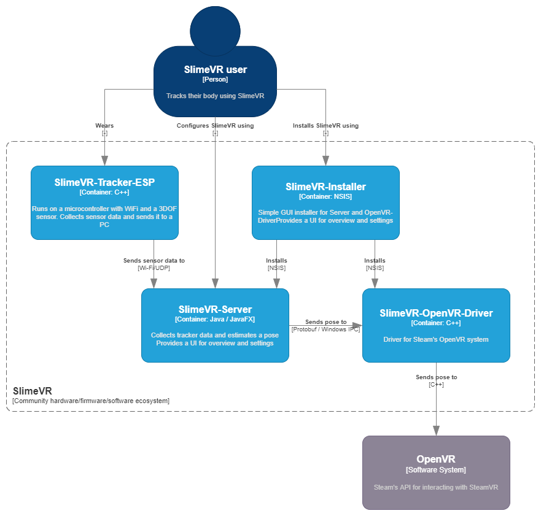
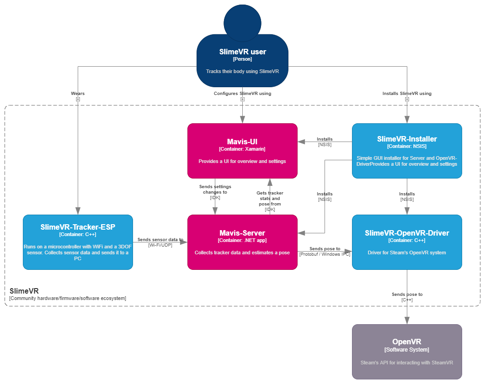
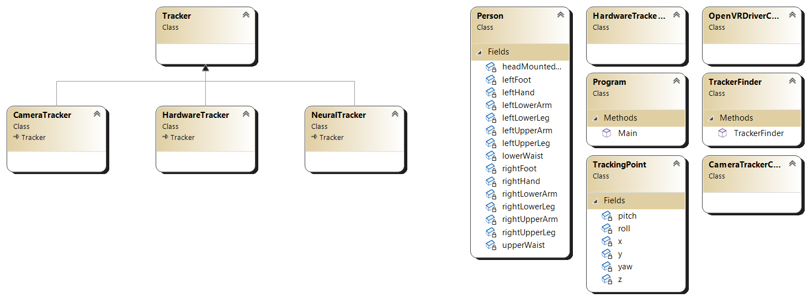

# ARC Poser

A SlimeVR-compatible pose estimation program. It's like SlimeVR-Server, but reimplemented to do body tracking in a different way.

## Diagrams

Here's a high-level overview of how I'm hoping this project will fit into the ecosystem.

### The old software system:

### The proposed software system:

## Software

### Pose and positioning algorithm

The algorithm will attempt to create a full table of values (x/y/z/pitch/yaw/roll) for all tracking points, regardless of which hardware trackers are actually equipped. We fill in this table in the following order:

- Collection of hardware sensor data
- OpenCV person detection using a webcam
- Tensorflow machine learning program that fills in the gaps, where data from the above two sources is used as the dataset

### Class diagram

## Links

http://www.open3d.org/
https://github.com/kzampog/cilantro
https://colmap.github.io/
https://github.com/nywang16/Pixel2Mesh
https://github.com/MIT-SPARK/Kimera-VIO
